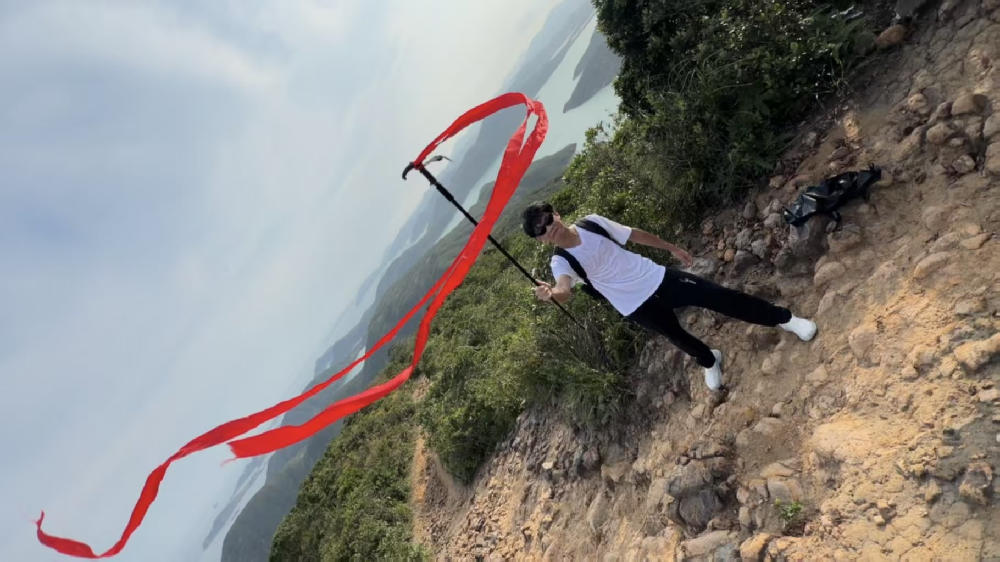
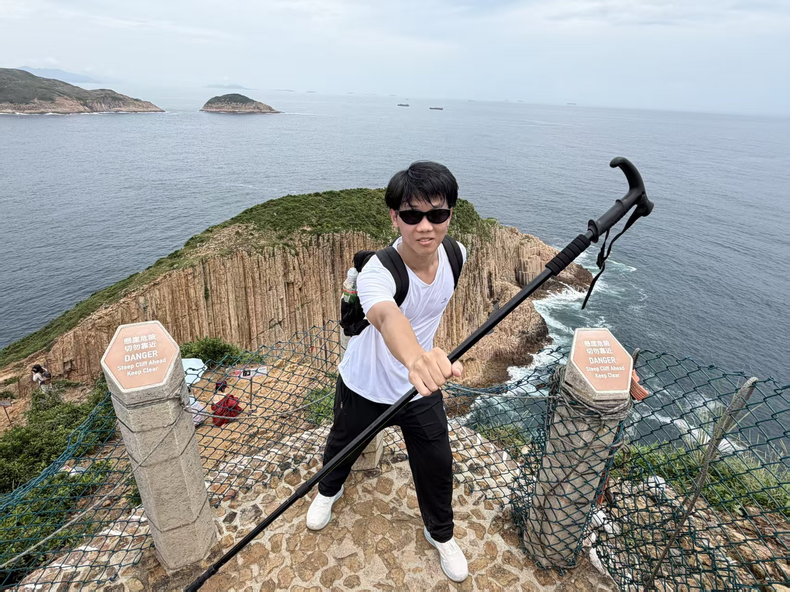
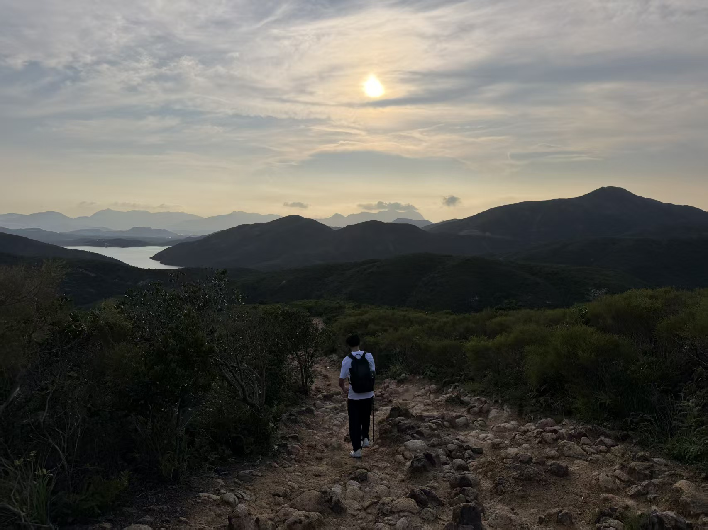

<!--
  GitHub Profile README · Zhu Fei
  将本文件与 assets/ 一并放入仓库：zhufeizuishuai/zhufeizuishuai

  徒步照片（建议 3:4 竖图，色调偏暗、略去饱和，四张风格统一）：
    assets/hiking-01.jpg
    assets/hiking-02.jpg
    assets/hiking-03.jpg
    assets/hiking-04.jpg

  骑行照片（沿用原路径）：
    assets/cycling-xds.png
    assets/cycling-night.png

  下方 TRAIL 01–04 的标题可改成真实路线名。
-->

 

 

<em>Distributed systems, high concurrency, and AI that actually ships. 
Pace the work. Trust the data. Leave the architecture cleaner than you found it.</em>

 

  <h2>ENGINEERING</h2>

<table>
  <tr>
    <td align="center" width="33%" valign="top">
        
      <b>Language</b> 
      Spring Boot · MyBatis-Plus
    </td>
    <td align="center" width="33%" valign="top">
        
      <b>Systems</b> 
      Nacos · Gateway · Feign · Sentinel · Seata
    </td>
    <td align="center" width="33%" valign="top">
        
      <b>Intelligence</b> 
      RAG · Function Calling · Flux
    </td>
  </tr>
  <tr>
    <td align="center" valign="top">
        
      <b>Data</b> 
      Schema · Queries · Consistency
    </td>
    <td align="center" valign="top">
        
      <b>Cache</b> 
      Two-tier · Hot keys
    </td>
    <td align="center" valign="top">
        
      <b>Async</b> 
      Decoupling · Peak shaving
    </td>
  </tr>
</table>

 

  

 

 

  
  

 

 

  <h2>BEYOND THE KEYBOARD</h2>
  
<em>Two kinds of distance. Both keep the signal clean.</em>

 

  

When the IDE goes dark, the road lights up. 
Cadence, climb, recover, repeat — the same discipline that ships reliable backends.

 

&nbsp;&nbsp;

  

 

  

The mountain does not care about your sprint. 
Only whether you keep moving — weather, quiet, and a longer horizon.

 

<!-- 徒步四宫格：替换 assets/hiking-01.jpg ~ hiking-04.jpg，并把标题改成你的路线名 -->

<table>
  <tr>
    <td align="center" width="50%" valign="top">
        
      01  —  TRAIL
    </td>
    <td align="center" width="50%" valign="top">
        
      02  —  TRAIL
    </td>
  </tr>
  <tr>
    <td align="center" width="50%" valign="top">
        
      03  —  TRAIL
    </td>
    <td align="center" width="50%" valign="top">
        
      04  —  TRAIL
    </td>
  </tr>
</table>

 

