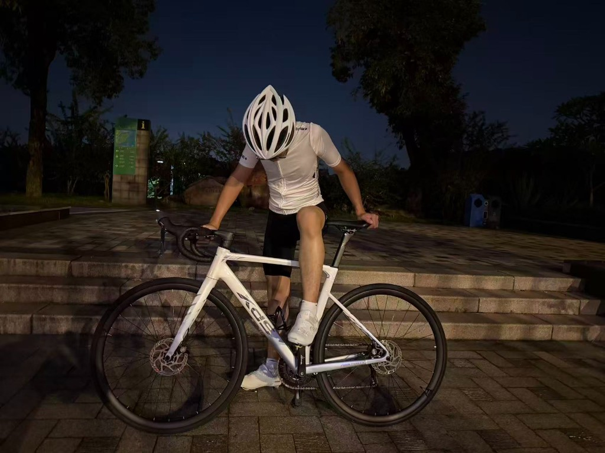
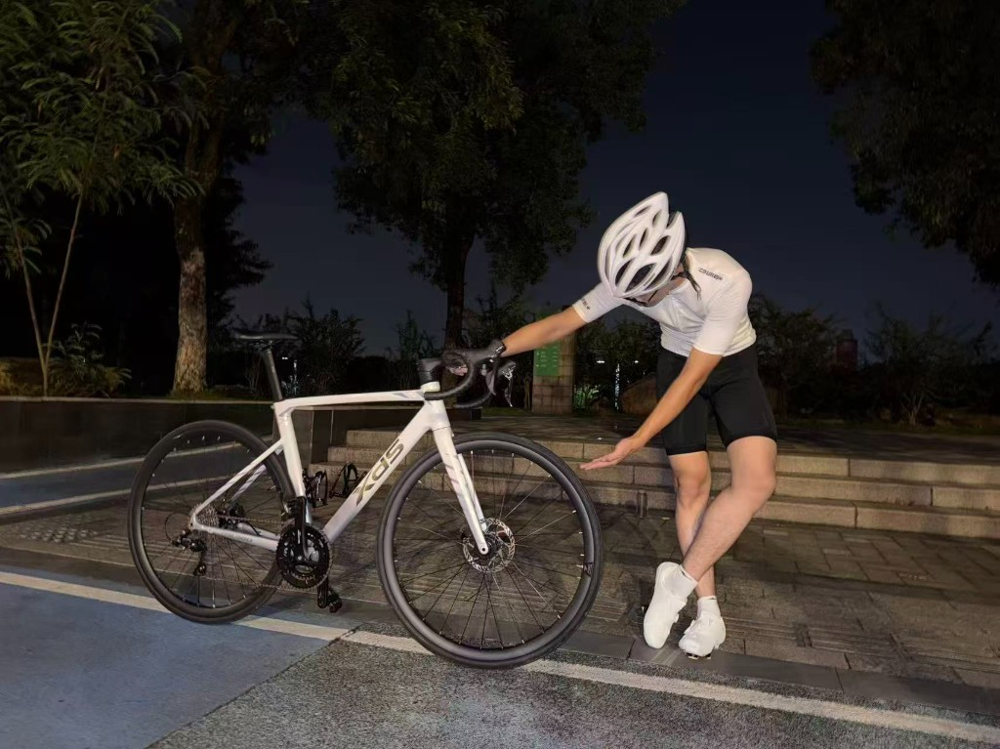

 

 

## ⚡ What I Crush

<table>
  <tr>
    <td align="center" width="33%">
        
      <b>Core Language</b> 
      Spring Boot · MyBatis-Plus
    </td>
    <td align="center" width="33%">
        
      <b>Microservices</b> 
      Nacos · Gateway · Feign · Sentinel · Seata
    </td>
    <td align="center" width="33%">
        
      <b>AI Engineering</b> 
      RAG · Function Calling · Flux
    </td>
  </tr>
  <tr>
    <td align="center">
        
      <b>Data Layer</b> 
      Schema design · Queries
    </td>
    <td align="center">
        
      <b>Cache & Speed</b> 
      Two-tier cache · Hot keys
    </td>
    <td align="center">
        
      <b>Async & Peak</b> 
      Decoupling · Peak shaving
    </td>
  </tr>
</table>

 

  

 

 

  
  

  

 

 

## 🚴 Beyond the Keyboard

  

When the IDE goes dark, the road lights up. Road cycling keeps me sharp — cadence, climb, recover, repeat. 
Same mindset as shipping backends: pace yourself, trust the data, chase the next personal best.

  

&nbsp;&nbsp;

 

